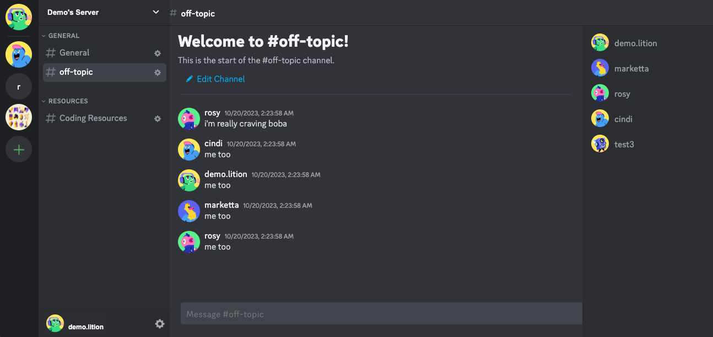

          

# dupecord


## Table of Contents

- [About](#about)
- [Wiki](#wiki)
- [Live Demo](#live-demo)
- [Technologies Used](#technologies-used)
- [Key Features](#key-features)
- [Code Snippets](#code-snippets)
- [Future Plans](#future-plans)
- [Development](#development)

## About
dupecord is a clone of the popular communication platform, Discord. It provides a real-time chat application designed to replicate the functionality and user experience of Discord. Users can create servers/channels to discuss any topic they would like and chat with friends, just like they would on Discord.


## Live Demo
**Live Demo Link:** [dupecord](https://dupecord.onrender.com)

## Wiki
See the [wiki](https://github.com/cubeydice/dupecord/wiki) for additional information on the following:
1. Schema
2. Sample State
3. Frontend Routes
4. Backend Routes

## Technologies Used

### Frontend
- Web interface: HTML, CSS, JavaScript
- User interface: React
- State management library: Redux
- Real-time chat: Websockets via ActionCable

### Backend
- Server-side runtime environment: Ruby on Rails
- Real-time chat: WebSockets via ActionCable, Redis
- Database system: PostgreSQL

### Other
- Server deployment: Render
- Source code management: Git, Github
- Analytics: Google Analytics

## Key Features

With dupecord, you can
- create an account and log in securely
- create, read, update, and destroy your own servers
- create, read, update, and destroy channels within your servers
- create, read messages in your channels

## Code Snippets
### Real-time Chat
When a user logs in and accesses a server, a component is mounted on the frontend to create a WebSocket subscription for every channel. These subscriptions listen for any changes to the backend state of messages. Any change to the backend state is communicated to the frontend state for any logged-in users and the webpage is updated via a React useEffect listening to these changes.

```JavaScript
//frontend
useEffect(() => {
    const subscription = consumer.subscriptions.create(
    { channel: 'ChannelsChannel', id: channelId },
    {
        received: message => {
        dispatch(receiveMessage(message))
        }
    }
);

//backend controller
    def create
        @message = Message.new(message_params)
        @message.user_id = current_user.id

        if @message.save
          ChannelsChannel.broadcast_to(@message.messageable,
          from_template("api/messages/show", message: @message))
          render json: {hello: 'world'}, status: :ok
        else
          render json: {errors: @message.errors.full_messages}, status: 422
        end
    end
```

### Message Input
Event handlers are utilized to handle changes message input and used in conjunction with useState to only submit if the content of the message is not empty.

```JavaScript
//Example of event handlers for message input
const dispatch = useDispatch();
const [content, setContent] = useState('');
const [isSubmitDisabled, setSubmitDisabled] = useState(true);

const handleSubmit = (e) => {
    e.preventDefault();

    //only send message if not blank
    if (!isSubmitDisabled) {
        const message = {
            content,
            messageable_type: 'Channel',
            messageable_id: channel.id
        }
        dispatch(createMessage(message)).then(() => {setContent('')})
        setSubmitDisabled(true)
    }
}

const handleChange = (e) => {
    e.preventDefault();

    if (content === " ") setSubmitDisabled(true)
    else {
        if (content.length > 1 && content.slice(-1) !== " ") {
            setSubmitDisabled(false)
        }
    };

    setContent(e.currentTarget.value)
}
```

# Future Plans
* Update and delete features for messages
* Implementing AWS for user profile pictures
* WebSocket via Action Cable integration of server, channel, and user statuses to show which servers/channels have new messages and which users are online
* A server invite system to allow users in servers to create invitation links
* Search functionality
* Utilizing the polymorphic nature of messages set up in the backend to create messages for direct messaging with friends

# Development
## Setup Instructions
### Backend Setup (Rails API)
1. Clone the repository:
    ```bash
    git clone https://github.com/cubeydice/dupecord.git
    ```

2. Install the required gems:
    ```bash
    bundle install
    ```
3. Setup the database:
    ```bash
    rails db:create
    rails db:migrate
    rails db:seed
    ```

4. Start the Rails server:
    ```bash
    rails s
    ```
### Frontend Setup (React)
1. Navigate to the `frontend` directory:
    ```bash
    cd frontend
    ```

2. Install the required packages:
    ```bash
    npm install
    ```
3. Start the React development server:
    ```bash
    npm start
    ```
